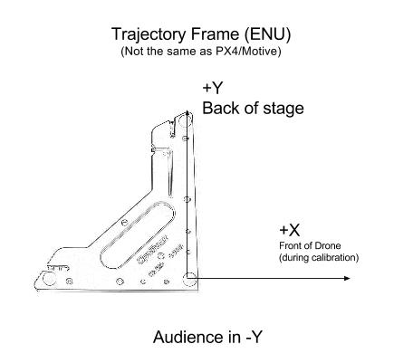
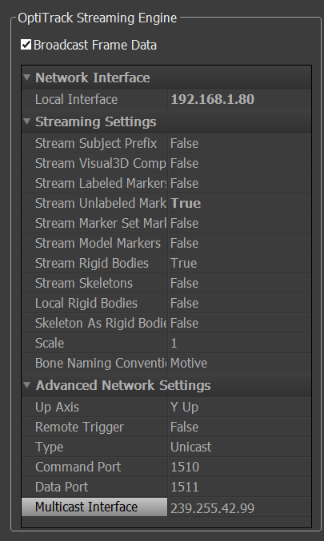

Tansa Documentation
===================

A general overview of all the hardware components of the system can be found below:

For networking, we use the following network configurations:

- Drone network
	- WiFi router setup to 192.168.1.1
	- Each drone has a static IP in the range 192.168.1.(80 + X) where X is the drone number
	- Change router DHCP server to only assign in the range 192.168.1.100 to 192.168.1.254
		- This way a computer can not collide ips with a drone
	- MavESP8266 Hport set to 14550 + X*10 for each drone
	- Disable router firewall and any packet prioritization features

When calibrating the motion system, the below coordinate system should be marked with tape on the ground. This will represent the (0,0) origin for all maneuvers performed. Note that +Y is along the long end of the CS200 calibration square. When defining the rigid bodies in Motive, make sure that the drone is pointing in the calibration direction specified below.

When setting up OptiTrack Motive, the following settings should be used. Please note that the program is set to unicast and streams both rigid bodies and unlabeled markers.

