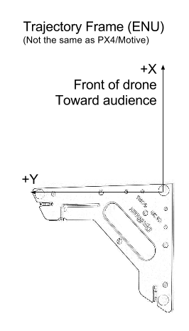

Tansa Documentation
===================

A general overview of all the hardware components of the system can be found below:

For networking, we use the following network configurations:

- Drone network
	- WiFi router setup to 192.168.8.1
	- Each drone has a static IP in the range 192.168.8.8X where X is the drone number

When calibrating the motion system, the below coordinate system should be marked with tape on the ground. This will represent the (0,0) origin for all manuevers performed. Note that +Y is along the long end of the CS200 calibration square.

