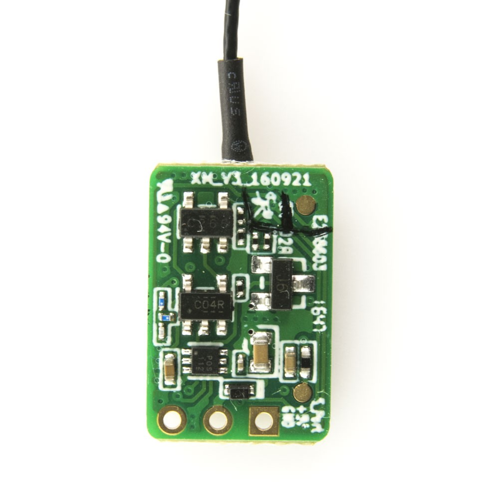
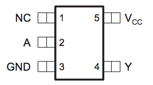
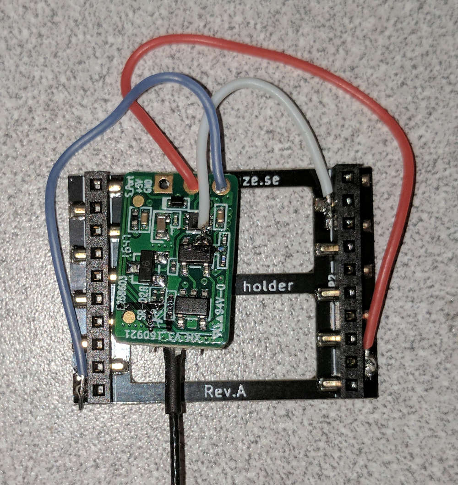
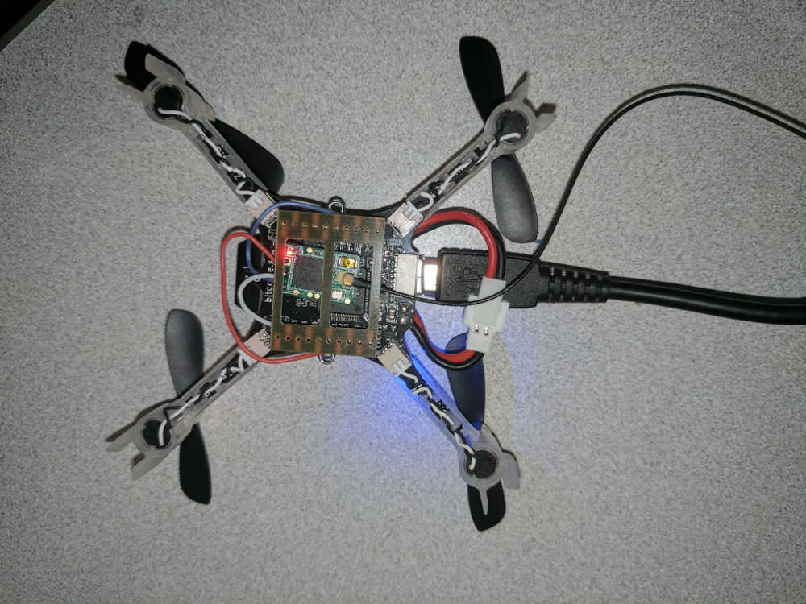

RC Receiver Details
===================

A small RC receiver can be added to the Crazyflie. We use an `FrSky XM` as it is very small and supports an easy to use serial SBus protocol.

FrSky XM
---------

PCB details:
- In the below image the top-left chip labeled C265 is a SN74LVC1G126 logic buffer in an SOT23-5 package
	- The output of it is connected to the S.Port pin
- The chip below it labeled C04R is a SN74LVC1G04 inverter gate which inverts the serial stream from the processor (as SBUS is an inverted protocol) and passes it into the above gate

The pinout of the inverter chip is below:

Connecting to a Crazyflie
-------------------------

SBus is an inverted serial protocol so typically most modern flight controllers have a hardware inverter to invert the signal before reading it as a plain serial line. Unfortunately the Crazyflie does not have one, but this can be solved by bypassing the inverter on the receiver side.

Below is a receiver wired to a battery holder and mounted below the Crazyflie. We use the VCOM, GND, and UART RX pins on the CF2. The UART is soldered to the 'A' pin of the inverter shown in the previous section. (Note that we use the extra long headers which can be purchased with the CF2)

This requires the patch to enable RC input here: https://github.com/dennisss/Firmware/commit/021d1fef85843153ba74a548655a1d2ff208d435

