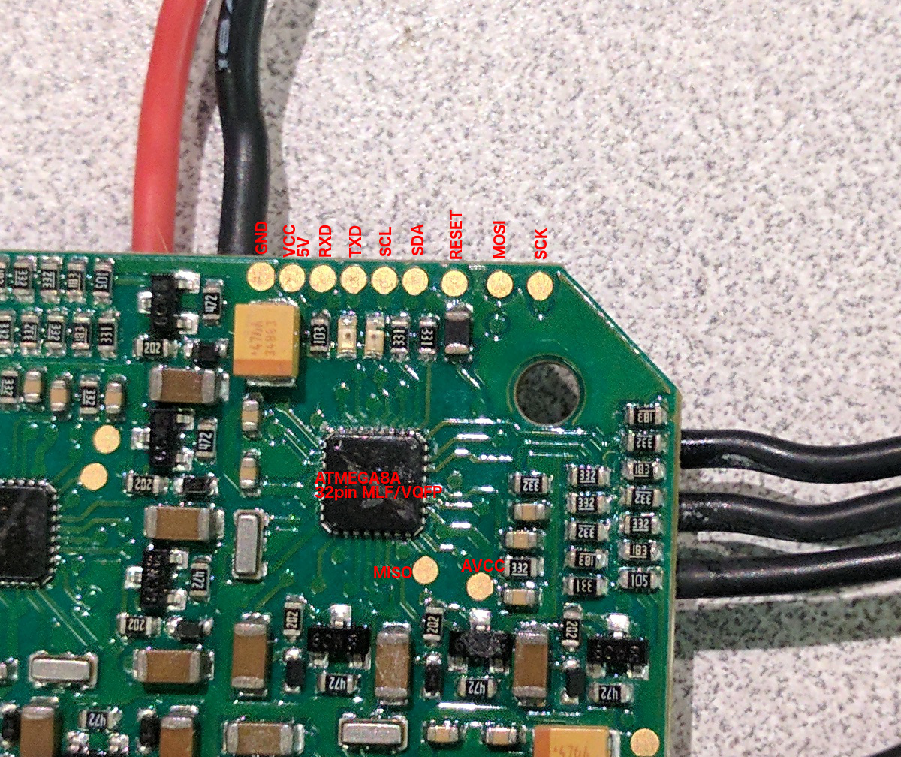

ESC
===

We use an AfroESC Quattro ESC and solder all motors directly to the ESC. In order to get the motor directions correct, we test them after it is assembled and use the AfroESC USB programming tool (https://hobbyking.com/en_us/afro-esc-usb-programming-tool.html) to reprogram the direction in the SimonK firmware

If one of the boards gets corrupted during flashing, we can use a standard AVR programmer connected to the pads on the board. We've reverse engineered the pinouts of the pads below. The pads are also useful if you want to connect the ESCs via UART or I2C:

